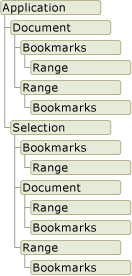

# Übersicht über das Word-Objektmodell
  Wenn Sie Word-Lösungen in Visual Studio entwickeln, interagieren Sie mit dem Word-Objektmodell. Dieses Objektmodell besteht aus Klassen und Schnittstellen, die in der primären Interopassembly für Word bereitgestellt und im Namespace <xref:Microsoft.Office.Interop.Word> definiert werden.

 [!INCLUDE[appliesto_wdalldocapp](../vsto/includes/appliesto-wdalldocapp-md.md)]

 Dieses Thema enthält eine kurze Übersicht über das Word-Objektmodell. Ressourcen, in denen Sie mehr über das gesamte Word-Objektmodell erfahren können, finden Sie unter [verwenden die Dokumentation zum Word-Objektmodell](#WordOMDocumentation).

 Informationen zur Verwendung des Word-Objektmodells für bestimmte Aufgaben finden Sie unter den folgenden Themen:

- [Arbeiten mit Dokumenten](../vsto/working-with-documents.md)

- [Arbeiten Sie mit Text in Dokumenten](../vsto/working-with-text-in-documents.md)

- [Arbeiten mit Tabellen](../vsto/working-with-tables.md)

##  Verstehen von Word-Objektmodell
 Word stellt Hunderte von Objekten bereit, mit denen Sie interagieren können. Diese Objekte werden in einer Hierarchie angeordnet, die eng an die Benutzeroberfläche angelehnt ist. An der Spitze dieser Hierarchie befindet sich das <xref:Microsoft.Office.Interop.Word.Application> -Objekt. Dieses Objekt stellt die aktuelle Instanz von Word dar. Das <xref:Microsoft.Office.Interop.Word.Application> -Objekt enthält die <xref:Microsoft.Office.Interop.Word.Document>-, <xref:Microsoft.Office.Interop.Word.Selection>-, <xref:Microsoft.Office.Interop.Word.Bookmark>- und <xref:Microsoft.Office.Interop.Word.Range> -Objekte. Jedes dieser Objekte verfügt über zahlreiche Methoden und Eigenschaften, auf die Sie zum Bearbeiten des Objekts und Interagieren mit dem Objekt zugreifen können.

 Die folgende Abbildung zeigt eine Ansicht dieser Objekte in der Hierarchie des Word-Objektmodells.

 

 Auf den ersten Blick scheinen sich die Objekte zu überlappen. Die <xref:Microsoft.Office.Interop.Word.Document> - und <xref:Microsoft.Office.Interop.Word.Selection> -Objekte sind beide Elemente des <xref:Microsoft.Office.Interop.Word.Application> -Objekts, das <xref:Microsoft.Office.Interop.Word.Document> -Objekt ist jedoch auch ein Element des <xref:Microsoft.Office.Interop.Word.Selection> -Objekts. Sowohl das <xref:Microsoft.Office.Interop.Word.Document> - als auch das <xref:Microsoft.Office.Interop.Word.Selection> -Objekt enthält <xref:Microsoft.Office.Interop.Word.Bookmark> - und <xref:Microsoft.Office.Interop.Word.Range> -Objekte. Die Überlappung ist vorhanden, weil es mehrere Möglichkeiten gibt, auf den gleichen Typ von Objekt zuzugreifen. Angenommen, Sie wenden Formatierungen auf ein <xref:Microsoft.Office.Interop.Word.Range> -Objekt an. Sie möchten jedoch ggf. auf den Bereich der aktuellen Auswahl, eines bestimmten Absatzes, eines Abschnitts oder auf das gesamte Dokument zugreifen.

 In den folgenden Abschnitten werden die Objekte der obersten Ebene und ihre Interaktion miteinander kurz beschrieben. Dazu gehören die folgenden fünf Objekte:

- Application-Objekt

- Document-Objekt

- Selection-Objekt

- Range-Objekt

- Bookmark-Objekt

  Zusätzlich zum Word-Objektmodell stellen Office-Projekte in Visual Studio *Hostelemente* und *Hoststeuerelemente* bereit, die im Word-Objektmodell einige Objekte erweitern. Hostelemente und Hoststeuerelemente verhalten sich wie die Word-Objekte, die sie erweitern, verfügen jedoch auch über zusätzliche Funktionen, z. B. Datenbindungsfunktionen und zusätzliche Ereignisse. Weitere Informationen finden Sie unter [Automatisieren von Word mithilfe von erweiterten Objekten](../vsto/automating-word-by-using-extended-objects.md) und [hosten Elemente und Übersicht zu Steuerelementen](../vsto/host-items-and-host-controls-overview.md).

### Application-Objekt
 Das <xref:Microsoft.Office.Interop.Word.Application> -Objekt stellt die Word-Anwendung dar und ist das übergeordnete Element aller anderen Objekte. Seine Elemente gelten normalerweise für Word als Ganzes. Sie können seine Eigenschaften und Methoden zum Steuern der Word-Umgebung verwenden.

 In VSTO-Add-In-Projekten können Sie mithilfe des <xref:Microsoft.Office.Interop.Word.Application> -Felds der `Application` -Klasse auf das `ThisAddIn` -Objekt zugreifen. Weitere Informationen finden Sie unter [Programm VSTO-Add-ins](../vsto/programming-vsto-add-ins.md).

 In Projekten auf Dokumentebene können Sie auf das <xref:Microsoft.Office.Interop.Word.Application> -Objekt mithilfe der Eigenschaft <xref:Microsoft.Office.Tools.Word.Document.Application%2A> der Klasse `ThisDocument` zugreifen.

### Document-Objekt
 Das <xref:Microsoft.Office.Interop.Word.Document> -Objekt ist für die Programmierung von Word wesentlich. Es stellt ein Dokument und seinen gesamten Inhalt dar. Wenn Sie ein Dokument öffnen oder ein neues Dokument erstellen, erstellen Sie ein neues <xref:Microsoft.Office.Interop.Word.Document> -Objekt, das der Auflistung <xref:Microsoft.Office.Interop.Word.Documents> des <xref:Microsoft.Office.Interop.Word.Application> -Objekts hinzugefügt wird. Das Dokument, das den Fokus besitzt, wird als das aktive Dokument bezeichnet. Es wird durch die Eigenschaft <xref:Microsoft.Office.Interop.Word._Application.ActiveDocument%2A> des <xref:Microsoft.Office.Interop.Word.Application> -Objekts dargestellt.

 Die Office-Entwicklungstools in Visual Studio erweitern das <xref:Microsoft.Office.Interop.Word.Document> -Objekt, indem sie den <xref:Microsoft.Office.Tools.Word.Document> -Typ bereitstellen. Dieser Typ ist ein *Hostelement* , das Ihnen den Zugriff auf alle Features eines <xref:Microsoft.Office.Interop.Word.Document> -Objekts ermöglicht und zusätzliche Ereignisse sowie die Möglichkeit zum Hinzufügen verwalteter Steuerelemente hinzufügt.

 Wenn Sie ein Projekt auf Dokumentebene erstellen, können Sie auf <xref:Microsoft.Office.Tools.Word.Document> -Elemente mithilfe der generierten Klasse `ThisDocument` in Ihrem Projekt zugreifen. Können Sie auf Elemente des <xref:Microsoft.Office.Tools.Word.Document> -Hostelements mithilfe der Schlüsselwörter **Me** oder **this** aus Code in der Klasse `ThisDocument` oder mithilfe von `Globals.ThisDocument` aus Code außerhalb der Klasse `ThisDocument` -Objekt zugreifen. Weitere Informationen finden Sie unter [Programmieren von Anpassungen auf Dokumentebene](../vsto/programming-document-level-customizations.md). Zum Auswählen des ersten Absatzes im Dokument verwenden Sie beispielsweise den folgenden Code.

 [!code-vb[Trin_VstcoreWordAutomation#120](../vsto/codesnippet/VisualBasic/Trin_VstcoreWordAutomationVB/ThisDocument.vb#120)]
 [!code-csharp[Trin_VstcoreWordAutomation#120](../vsto/codesnippet/CSharp/Trin_VstcoreWordAutomationCS/ThisDocument.cs#120)]

 Sie können in VSTO-Add-in-Projekte generieren <xref:Microsoft.Office.Tools.Word.Document> Hostelemente zur Laufzeit. Sie können das generierte Hostelement zum Hinzufügen von Steuerelementen zum zugehörigen Dokument verwenden. Weitere Informationen finden Sie unter [Erweitern von Word-Dokumenten und Excel-Arbeitsmappen in VSTO-Add-ins zur Laufzeit](../vsto/extending-word-documents-and-excel-workbooks-in-vsto-add-ins-at-run-time.md).

### Selection-Objekt
 Das <xref:Microsoft.Office.Interop.Word.Selection> -Objekt stellt den Bereich dar, der zurzeit ausgewählt ist. Beim Ausführen eines Vorgangs in der Word-Benutzeroberfläche (z. B. Fettformatieren von Text) wählen Sie den Text aus oder markieren ihn, und wenden dann die Formatierung an. Das <xref:Microsoft.Office.Interop.Word.Selection> -Objekt ist in einem Dokument immer vorhanden. Wenn nichts ausgewählt ist, stellt es die Einfügemarke dar. Darüber hinaus kann eine Auswahl mehrere Textblöcke umfassen, die nicht zusammenhängend sind.

### Range-Objekt
 Das <xref:Microsoft.Office.Interop.Word.Range> -Objekt stellt einen zusammenhängenden Bereich in einem Dokument dar und wird durch eine Startzeichenposition und eine Endzeichenposition definiert. Es besteht keine Einschränkung auf ein einzelnes <xref:Microsoft.Office.Interop.Word.Range> -Objekt. Sie können mehrere <xref:Microsoft.Office.Interop.Word.Range> -Objekte im gleichen Dokument definieren. Ein <xref:Microsoft.Office.Interop.Word.Range> -Objekt weist folgende Merkmale auf:

- Es kann aus der Einfügemarke allein, einem Textbereich oder dem gesamten Dokument bestehen.

- Es enthält nicht druckbare Zeichen wie z. B. Leerzeichen, Tabstoppzeichen und Absatzmarken.

- Es kann sich um den Bereich handeln, der die aktuelle Auswahl dargestellt, oder es kann einen anderen Bereich als die aktuelle Auswahl darstellen.

- Es ist in einem Dokument im Gegensatz zu einer Auswahl, die immer sichtbar ist, nicht sichtbar.

- Es wird nicht mit dem Dokument gespeichert und existiert nur, während der Code ausgeführt wird.

  Wenn Sie am Ende eines Bereichs Text einfügen, erweitert Word den Bereich automatisch so, dass der eingefügte Text berücksichtigt wird.

### Inhaltssteuerelement-Objekte
 Ein <xref:Microsoft.Office.Interop.Word.ContentControl> -Objekt bietet eine Möglichkeit, die Eingabe und die Darstellung von Text und anderen Typen von Inhalt in Word-Dokumenten zu steuern. Ein <xref:Microsoft.Office.Interop.Word.ContentControl> -Objekt kann verschiedene Typen von Benutzeroberflächen anzeigen, die für die Verwendung in Word-Dokumenten optimiert sind, z. B. ein Rich-Text-Steuerelement, eine Datumsauswahl oder ein Kombinationsfeld. Sie können auch ein <xref:Microsoft.Office.Interop.Word.ContentControl> -Objekt verwenden, um zu verhindern, dass Benutzer Abschnitte des Dokuments oder der Vorlage bearbeiten können.

 Visual Studio erweitert das <xref:Microsoft.Office.Interop.Word.ContentControl> -Objekt in mehrere unterschiedliche Hoststeuerelemente. Während das <xref:Microsoft.Office.Interop.Word.ContentControl> -Objekt jeden der verschiedenen Typen von Benutzeroberflächen anzeigen kann, die für Inhaltssteuerelemente verfügbar sind, stellt Visual Studio einen anderen Typ für jedes Inhaltssteuerelement bereit. Beispielsweise können Sie ein <xref:Microsoft.Office.Tools.Word.RichTextContentControl> -Objekt zum Erstellen eines Rich-Text-Steuerelements oder ein <xref:Microsoft.Office.Tools.Word.DatePickerContentControl> -Objekt zum Erstellen einer Datumsauswahl verwenden. Diese Hoststeuerelemente verhalten sich wie das systemeigene <xref:Microsoft.Office.Interop.Word.ContentControl>-Objekt, verfügen jedoch über zusätzliche Ereignisse und Datenbindungsfunktionen. Weitere Informationen finden Sie unter [Inhaltssteuerelemente](../vsto/content-controls.md).

### Bookmark-Objekt
 Das <xref:Microsoft.Office.Interop.Word.Bookmark> -Objekt stellt einen zusammenhängenden Bereich in einem Dokument mit einer Anfangsposition und einer Endposition dar. Sie können Lesezeichen verwenden, um eine Position in einem Dokument zu markieren, oder als einen Container für Text in einem Dokument. Ein <xref:Microsoft.Office.Interop.Word.Bookmark> -Objekt kann aus der Einfügemarke bestehen oder so groß wie das gesamte Dokument sein. Ein <xref:Microsoft.Office.Interop.Word.Bookmark> -Objekt weist die folgenden Merkmale auf, die es vom <xref:Microsoft.Office.Interop.Word.Range> -Objekt unterscheiden:

- Sie können das Lesezeichen zur Entwurfszeit benennen.

- <xref:Microsoft.Office.Interop.Word.Bookmark> -Objekte werden mit dem Dokument gespeichert und daher nicht gelöscht, wenn der Code nicht mehr ausgeführt oder das Dokument geschlossen wird.

- Lesezeichen können ausgeblendet oder sichtbar gemacht werden, indem die Eigenschaft <xref:Microsoft.Office.Interop.Word.View.ShowBookmarks%2A> der Klasse <xref:Microsoft.Office.Interop.Word.View> -Objekts auf **false** oder **true**.

  Visual Studio erweitert das <xref:Microsoft.Office.Interop.Word.Bookmark> -Objekt durch Bereitstellen des <xref:Microsoft.Office.Tools.Word.Bookmark> -Hoststeuerelements. Das <xref:Microsoft.Office.Tools.Word.Bookmark> -Hoststeuerelement verhält sich wie ein systemeigenes <xref:Microsoft.Office.Interop.Word.Bookmark>-Objekt, stellt jedoch zusätzliche Ereignisse und Datenbindungsfunktionen bereit. Sie können Daten an ein Bookmark-Steuerelement für ein Dokument auf die gleiche Weise binden wie Daten an ein Textfeld-Steuerelement für Windows Forms. Weitere Informationen finden Sie unter [Bookmark-Steuerelement](../vsto/bookmark-control.md).

##  Verwenden der Dokumentation zum Word-Objektmodell
 Ausführliche Informationen zum Word-Objektmodell finden Sie in der Referenz für die primäre Interopassembly (PIA) und der VBA-Objektmodellreferenz (Visual Basic for Applications).

### Primäre interop-Assembly-Verweis
 In der Referenzdokumentation für die Word-PIA werden die Typen in der primären Interopassembly für Word beschrieben. Diese Dokumentation ist aus folgendem Ort verfügbar: [Referenz für die primäre interop-Assembly von Word 2010](http://go.microsoft.com/fwlink/?LinkId=189588).

 Weitere Informationen zum Entwurf der Word-PIA, z. B. zu Unterschieden zwischen Klassen und Schnittstellen in der PIA und zur Implementierung von Ereignissen in der PIA, finden Sie unter [Übersicht über Klassen und Schnittstellen in den primären InteropassemblysfürOffice](http://go.microsoft.com/fwlink/?LinkId=189592).

### VBA-Objektmodellreferenz
 Die VBA-Objektmodellreferenz dokumentiert das Word-Objektmodell, das für VBA-Code (Visual Basic for Applications) zur Verfügung gestellt wird. Weitere Informationen finden Sie unter [Word 2010-Objektmodellreferenz](http://go.microsoft.com/fwlink/?LinkId=199772).

 Alle Objekte und Elemente in der VBA-Objektmodellreferenz entsprechen Typen und Elementen in der Word-PIA. Z. B. das Document-Objekt in der VBA-Objektmodellreferenz entspricht der <xref:Microsoft.Office.Interop.Word.Document> Objekt in der Word-PIA. Obwohl die VBA-Objektmodellreferenz Codebeispiele für die meisten Eigenschaften, Methoden und Ereignisse enthält, müssen Sie den VBA-Code in dieser Referenz in Visual Basic oder Visual C# übersetzen, wenn Sie ihn in einem mit Visual Studio erstellten Word-Projekt verwenden möchten.

## Siehe auch
- [Primäre Interopassemblys für Office](../vsto/office-primary-interop-assemblies.md)
- [Automatisieren von Word mithilfe von erweiterten Objekten](../vsto/automating-word-by-using-extended-objects.md)
- [Arbeiten mit Dokumenten](../vsto/working-with-documents.md)
- [Arbeiten Sie mit Text in Dokumenten](../vsto/working-with-text-in-documents.md)
- [Arbeiten mit Tabellen](../vsto/working-with-tables.md)
- [Hostelemente und Host-Steuerelementen (Übersicht)](../vsto/host-items-and-host-controls-overview.md)
- [Einschränkungen für programmgesteuerte Aufgaben von Hostelementen und Hoststeuerelementen](../vsto/programmatic-limitations-of-host-items-and-host-controls.md)
- [Optionaler Parameter in Office-Projektmappen](../vsto/optional-parameters-in-office-solutions.md)
