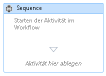
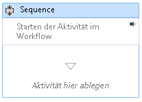

# Vorgehensweise: Hinzufügen von Kommentaren zu einem Workflow im Workflow-Designer

Um das Erstellen größerer, komplizierterer Workflows zu vereinfachen, ermöglicht .NET Framework 4,5 dem Entwickler das Hinzufügen von Anmerkungen zu den folgenden Elementtypen im Designer:

- <xref:System.Activities.Activity>

- <xref:System.Activities.Statements.State>

- <xref:System.Activities.Statements.Transition>

- Von <xref:System.Activities.Statements.FlowNode> abgeleitete Klassen

- <xref:System.Activities.Variable>

- <xref:System.Activities.Argument>

> [!IMPORTANT]
> Der Inhalt einer Anmerkung wird im Nur-Text-Format in der XAML-Datei gespeichert, die dem Workflow zugeordnet ist, und kann möglicherweise von anderen gelesen werden. Bedenken Sie diesen Umstand, wenn Sie vertrauliche Informationen in eine Anmerkung einfügen.

## Hinzufügen einer Anmerkung zu einer Aktivität im Designer

1. Klicken Sie im Workflow-Designer mit der rechten Maustaste auf ein Element im Workflow-Designer, **und wählen Sie Anmerkungen,** Anmerkung **Hinzufügen**aus.

1. Fügen Sie den Text der Anmerkung im angegebenen Bereich ein.

   Das Element zeigt ein Anmerkung-Symbol an. Wenn Sie den Mauszeiger über das Symbol "Anmerkung" bewegen, wird der Text der Anmerkung angezeigt.

## Anzeigen einer Anmerkung im Designer einer Aktivität

1. Klicken Sie bei einem Aktivitäts Designer, der eine Anmerkung außerhalb der Aktivität anzeigt, auf das **Pin** -Symbol im Funktions Indikator "Anmerkung".

   Die-Anmerkung wird im Aktivitäts-Designer angezeigt. Im unten stehenden Screenshot wird eine Anmerkung für die Startaktivität im Workflow im Aktivitäts-Designer angezeigt.

   

2. Um die Anmerkung außerhalb des Aktivitäts Designers anzuzeigen, bewegen Sie den Mauszeiger über den Bereich Anmerkung im Aktivitäts Designer, und klicken Sie auf das Symbol zum **lösen** .

   

## Ein- oder Ausblenden aller Anmerkungen

1. Klicken Sie mit der rechten Maustaste auf eine Aktivität, die eine Anmerkung enthält. Wählen Sie **Anmerkungen**und dann **alle Anmerkungen anzeigen**aus.

   Alle Anmerkungen werden in den Designer der Aktivität angezeigt.

1. Wenn Sie alle Anmerkungen außerhalb der Aktivitäts Designer anzeigen möchten, klicken Sie mit der rechten Maustaste auf die Aktivität, **und wählen Sie Anmerkungen aus**, und **blenden Sie alle Anmerkungen**aus.

## Bearbeiten oder Löschen einer Anmerkung für eine Aktivität

1. Klicken Sie mit der rechten Maustaste auf eine Aktivität, die eine Anmerkung enthält.

1. Wählen Sie **Anmerkungen**, Anmerkung **Bearbeiten** oder **Anmerkung löschen**aus.

   Die Anmerkung wird zum Bearbeiten oder löschen geöffnet.

1. Wenn Sie alle Anmerkungen gleichzeitig löschen möchten, klicken Sie mit der rechten Maustaste auf den Workflow-Designer, **und wählen Sie Anmerkung,** **alle Anmerkungen löschen**aus.

## Hinzufügen, Bearbeiten und Löschen einer Anmerkung für eine Variable oder ein Argument

1. Klicken Sie mit der rechten Maustaste auf eine Variable oder ein Argument, und wählen Sie Anmerkung hinzufügen.

1. Geben Sie den Text der Anmerkung ein. Die Variable oder das Argument zeigt ein Anmerkung-Symbol an.

1. Klicken Sie mit der rechten Maustaste auf eine Variable oder ein Argument, die bzw. das eine Anmerkung enthält. Wählen Sie Anmerkung bearbeiten aus.

   Die Anmerkung wird zur Bearbeitung geöffnet.

1. Klicken Sie mit der rechten Maustaste auf eine Variable oder ein Argument, die bzw. das eine Anmerkung enthält. Wählen Sie Anmerkung löschen aus.

   Die Anmerkung wird gelöscht.