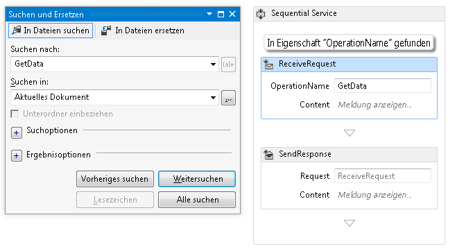

# Vorgehensweise: Verwenden der Suche im Workflow-Designer

Um zu ermöglichen, größerer, komplexerer Workflows zu erstellen, können Sie im Workflow-Designer zum Suchen von Elementen nach Schlüsselwort suchen. Beachten Sie, dass Ersetzen vom Designer nicht unterstützt wird.

## Schnellsuche

Schnellsuche findet der Designer die folgenden:

-   Eigenschaften von <xref:System.Activities.Activity>-Objekten, <xref:System.Activities.Statements.FlowNode>-Objekten, <xref:System.Activities.Statements.State>-Objekten, Übergängen und anderen benutzerdefinierten Flusssteuerungselementen.

-   Variablen

-   Argumente

-   Ausdrücke

### Verwenden der Schnellsuche

1. Mit dem Workflow-Designer öffnen, drücken Sie die **STRG + F**, oder wählen Sie **bearbeiten** > **suchen und Ersetzen** > **Schnellsuche**.

2. Geben Sie den Suchbegriff in das **Suchen nach** Textfeld, und klicken Sie auf **Weitersuchen**.

3. Der Suchbegriff befindet sich im aktuellen Workflow. Die folgende Abbildung zeigt ein aktivitätsanzeigename im Designer gefunden werden:

   

## Suchen in Dateien

Suche in Dateien sucht Zeichenfolgen in Workflowdateien, einschließlich XAML-Dateien.

### Verwenden Sie in Dateien suchen

1.  Drücken Sie in Visual Studio **STRG**+**UMSCHALT**+**F**, oder wählen Sie **bearbeiten**  >   **Suchen und Ersetzen** > **in Dateien suchen**.

2.  Geben Sie den Suchbegriff in das **Suchen nach** Textfeld, und klicken Sie auf **alle suchen**.

3.  Das Suchergebnis wird angezeigt, der **Suchergebnisse** anzeigen. Durch Doppelklicken auf ein Ergebniselement navigieren, auf die Aktivität, die die Übereinstimmung im Workflow-Designer enthält.