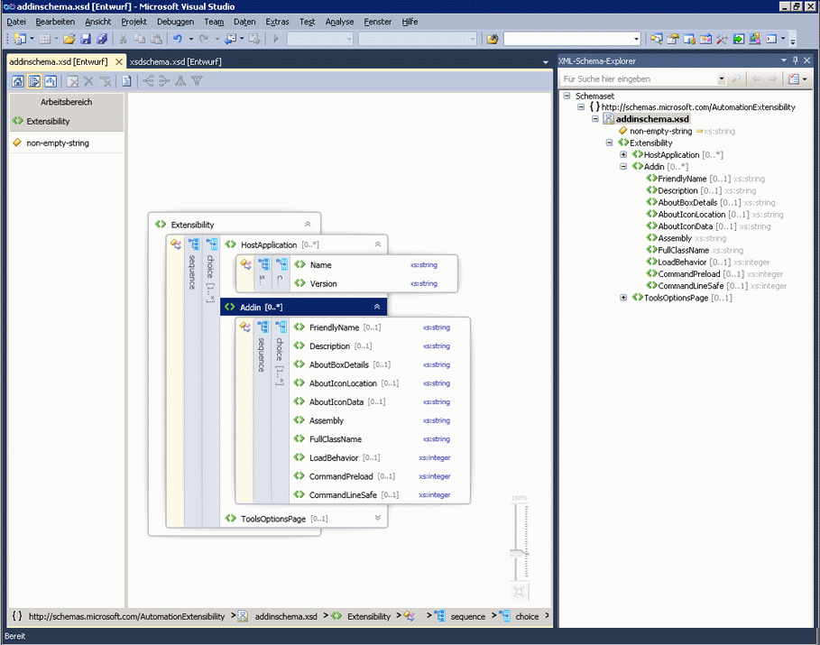

# Inhaltsmodellansicht

Die Inhaltsmodellansicht bietet eine grafische Darstellung lokaler und globaler Schemaknoten und ihrer Komponenten. Dazu zählen einfache und komplexe Typen, Elemente, Modellgruppen, Attribute und Attributgruppen. XML-Kommentare und -Verarbeitungsanweisungen können nicht in der Inhaltsmodellansicht angezeigt werden. Die Inhaltsmodellansicht enthält zwei Bereiche: einen **Arbeitsbereich** Bereich, der eine Liste der Knoten im enthält die [Arbeitsbereich des XML-Schema-Designers](../xml-tools/xml-schema-designer-workspace.md), und der Entwurfsoberfläche, die Sie, wo das Inhaltsmodell des Schemas sehen Knoten, die im ausgewählten der **Arbeitsbereich** Bereich. Die Inhaltsmodellansicht enthält auch die Symbolleiste des XML-Schema-Designers und die Breadcrumb-Leiste.

In der folgenden Abbildung ist die **Arbeitsbereich** Bereich enthält sechs Schemaknoten. Die `purchaseOrder` Knoten ist ausgewählt, der **Arbeitsbereich** Bereich und in der Entwurfsoberfläche angezeigt wird.

## Arbeitsbereich auswählen

Nachdem Sie dem Arbeitsbereich Knoten hinzugefügt haben, erscheint die Liste der Knoten der **Arbeitsbereich** Bereich von der Inhaltsmodellansicht. Bei Auswahl von Knoten in der **Arbeitsbereich** Bereich, die sie auf der Entwurfsoberfläche der Inhaltsmodellansicht angezeigt werden. Verwenden Sie zum Löschen von Knoten aus dem Arbeitsbereich, der XSD-Designer-Symbolleiste die **Arbeitsbereich** Bereich mit der rechten Maustaste im Menü oder die **löschen** Schlüssel.

Informationen zum Hinzufügen von Knoten finden Sie im Abschnitt "Hinzufügen von Knoten zum Arbeitsbereich" in [Arbeitsbereich des XML-Schema-Designers](../xml-tools/xml-schema-designer-workspace.md).

## Entwurfsoberfläche

Wenn ein Knoten ausgewählt ist, der **Arbeitsbereich** Bereich der Inhaltsmodellansicht-Entwurfsoberfläche, in dem Sie die Details des Knotens anzeigen können, wird hinzugefügt.

Das Inhaltsmodell eines Knotens wird durch eine erweiterbare grafische Struktur mit Elementen und Attributen als Strukturknoten dargestellt. Standardmäßig wird nur eine Ebene erweitert. Weitere Informationen wie Compositors, Typnamen, Gruppen und andere Container werden (bei erweiterter Struktur) auf einer vertikalen Leiste neben den zugehörigen Elementen und Attributen angezeigt. Wenn Sie auf einen vertikalen Balken doppelklicken, wird er horizontal dargestellt, und die Struktur wird reduziert. Wenn Sie auf einen horizontalen Balken doppelklicken, wird er vertikal dargestellt, und die Struktur wird erweitert. Auswahl des vertikalen Balkens wählt alle Knoten im Container. Erweiterungen werden auf der rechten Seite eines Knotens angezeigt, wenn ein Element erweitert oder reduziert werden kann.

Wenn die Entwurfsoberfläche leer ist, ist die XML-Editor, der **XML-Schema-Explorer**, und das Wasserzeichen angezeigt werden. Die *Wasserzeichen* ist eine Liste mit Links zu allen Ansichten des XSD-Designer. Wenn das Schemaset Fehler enthält, wird der folgende Text am Ende der Liste angezeigt: "Verwenden Sie die Fehlerliste, um anzuzeigen, und beheben Sie die Fehler in der Gruppe."

## Breadcrumb-Leiste

Die Breadcrumb-Leiste am unteren Rand der Inhaltsmodellansicht zeigt an, wo sich der ausgewählte Knoten im Schemaset befindet.

## Kontextmenüs

Wenn Sie mit der rechten Maustaste auf die Entwurfsoberfläche ein Element oder **Arbeitsbereich** Bereich ein Kontextmenü angezeigt. In der folgenden Tabelle werden die Optionen beschrieben, die für die Entwurfsoberfläche der Inhaltsmodellansicht verfügbar sind.

|Option|Beschreibung|
|-|-----------------|
|**Im XML-Schema-Explorer anzeigen**|Legt den Fokus auf den Schema-Explorer und hebt den Schemasetknoten hervor.|
|**In Diagrammansicht anzeigen**|Wechselt zur Diagrammansicht.|
|**Beispiel-XML generieren**|Ist nur für globale Elemente verfügbar. Generiert eine Beispiel-XML-Datei für das globale Element.|
|**Dokumentation anzeigen**|Blendet den Inhalt von Anmerkungs-/Dokumentationsknoten ein bzw. aus.|
|**Diagramm als Bild exportieren**|Speichert die Entwurfsoberfläche in einer XPS-Datei.|
|**Code anzeigen**|Öffnet die Datei, die den ausgewählten Knoten enthält, im XML-Editor. Das Element, das ausgewählt wird die **XML-Schema-Explorer** auch in der XML-Editor aktiviert ist.|
|**Eigenschaftenfenster**|Öffnet die **Eigenschaften** -Fenster (wenn es nicht bereits geöffnet ist). In diesem Fenster werden Informationen zum Knoten angezeigt.|

Die folgende Tabelle beschreibt die verfügbaren Optionen für die **Arbeitsbereich** Bereich.

|Option|Beschreibung|
|-|-----------------|
|**Im XML-Schema-Explorer anzeigen**|Legt den Fokus auf den Schema-Explorer und hebt den Schemasetknoten hervor.|
|**In Diagrammansicht anzeigen**|Wechselt zur Diagrammansicht.|
|**Arbeitsbereich löschen**|Löscht den Arbeitsbereich und die Entwurfsoberfläche.|
|**Aus Arbeitsbereich entfernen**|Entfernt ausgewählte Knoten aus dem Arbeitsbereich und der Entwurfsoberfläche.|
|**Alles außer Auswahl aus Arbeitsbereich entfernen**|Entfernt nicht ausgewählte Knoten aus dem Arbeitsbereich und der Entwurfsoberfläche.|
|**Beispiel-XML generieren**|Ist nur für globale Elemente verfügbar. Generiert eine Beispiel-XML-Datei für das globale Element.|
|**Wählen Sie alle**|Wählt alle Knoten in der **Arbeitsbereich** Bereich.|
|**Code anzeigen**|Öffnet die Datei, die den ausgewählten Knoten enthält, im XML-Editor. Das Element, das ausgewählt wird die **XML-Schema-Explorer** auch in der XML-Editor aktiviert ist.|
|**Eigenschaftenfenster**|Öffnet die **Eigenschaften** -Fenster (wenn es nicht bereits geöffnet ist). In diesem Fenster werden Informationen zum Knoten angezeigt.|

## Eigenschaftenfenster

Verwenden Sie das Kontextmenü (Kontext) um zu Beginn zu öffnen der **Eigenschaften** Fenster. In der Standardeinstellung die **Eigenschaften** Fenster wird angezeigt, in der unteren rechten Ecke von Visual Studio. Wenn Sie einen Knoten, die in der Inhaltsmodellansicht gerendert wird klicken, werden die Eigenschaften des Knotens angezeigt, der **Eigenschaften** Fenster.

## XSD-Designer-Symbolleiste

Die folgenden XSD-Designer-Symbolleistenschaltflächen sind aktiviert, wenn die Inhaltsmodellansicht aktiv ist.

|Option|Beschreibung|
|-|-----------------|
|**Ausgangsansicht anzeigen**|Wechselt in den [Ausgangsansicht](../xml-tools/start-view.md). In dieser Ansicht kann mit der Tastenkombination zugegriffen werden: **Ctrl**+**1**.|
|**Inhaltsmodellansicht anzeigen**|Wechselt in den [Inhalt Modellansicht](../xml-tools/content-model-view.md). In dieser Ansicht kann mit der Tastenkombination zugegriffen werden: **Ctrl**+**2**.|
|**Diagrammansicht anzeigen**|Wechselt in den [Diagrammansicht](../xml-tools/graph-view.md). In dieser Ansicht kann mit der Tastenkombination zugegriffen werden: **Ctrl**+**3**.|
|**Arbeitsbereich löschen**|Löscht den Arbeitsbereich und die Entwurfsoberfläche.|
|**Aus Arbeitsbereich entfernen**|Entfernt ausgewählte Knoten aus dem Arbeitsbereich und der Entwurfsoberfläche.|
|**Alles außer Auswahl aus Arbeitsbereich entfernen**|Entfernt nicht ausgewählte Knoten aus dem Arbeitsbereich und der Entwurfsoberfläche.|
|**Dokumentation anzeigen**|Blendet den Inhalt von Anmerkungs-/Dokumentationsknoten ein bzw. aus.|

## Schwenken/Bildlauf

Sie können ihn Schwenken die Entwurfsoberfläche, mit den Bildlaufleisten oder durch Drücken der **STRG** gedrückt, während Sie klicken und die Maus ziehen. Wenn Sie auf die Entwurfsoberfläche mittels klicken und ziehen schwenken, ändert sich der Cursor in vier weisende Pfeile, die in unterschiedliche Richtungen.

## Rückgängig/Wiederholen

Die Funktion zum Rückgängigmachen bzw. Wiederholen ist in der Inhaltsmodellansicht für folgende Aktionen aktiviert:

-   Hinzufügen eines einzelnen Knotens per Drag & Drop

-   Hinzufügen mehrerer Knoten aus dem Suchergebnisfenster im Schema-Explorer

-   Hinzufügen von Knoten aus der Ausgangsansicht

-   Löschen einzelner oder mehrerer Knoten

## Zoom

Zoom ist in der unteren rechten Ecke der Inhaltsmodellansicht verfügbar.

Der Zoomfaktor kann wie folgt gesteuert werden:

-   Durch Drücken der **STRG** whell Schlüssel, und drehen Sie die Maus, wenn die Maus über die Oberfläche der Inhaltsmodellansicht zeigt.

-   Verwenden Sie das Schieberegler-Steuerelement. Auf dem Schieberegler wird der aktuelle Zoomfaktor angezeigt.

Der Zoomschieberegler ist nicht transparent, wenn Sie es auswählen, zeigen Sie darauf, oder verwenden **STRG** mit dem Mausrad zum Zoomen, in allen anderen Fällen ist er transparent.

## Integration des XML-Editors

Sie können zwischen hin und her wechseln die **XSD-Designer** und dem XML-Editor über das Kontextmenü (Kontext).

Wenn Sie Änderungen am Schemaset im XML-Editor vornehmen, werden die Änderungen in der Inhaltsmodellansicht synchronisiert. Weitere Informationen finden Sie unter [-Integration mit XML-Editor](../xml-tools/integration-with-xml-editor.md).

## Siehe auch

- [Arbeitsbereich des XML-Schema-Designers](../xml-tools/xml-schema-designer-workspace.md)