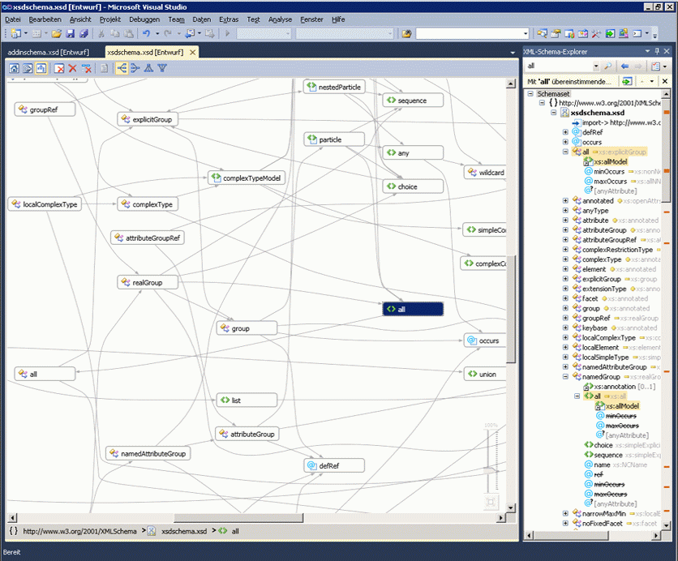
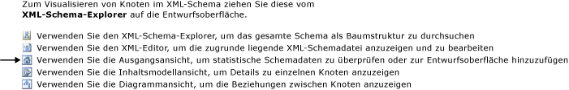

# Diagrammansicht

Die Diagrammansicht bietet eine grafische Darstellung der globalen Schemaknoten und der Beziehungen zwischen den Knoten. In der Diagrammansicht kann das Layout des Schemasets auf der Entwurfsoberfläche nicht geändert werden. Die Diagrammansicht enthält auch die Symbolleiste des XML-Schema-Designers und die Breadcrumb-Leiste.

 Das folgende Bild zeigt die Diagrammansicht mit sechs globalen Knoten auf der Entwurfsoberfläche.

 

## Entwurfsoberfläche

 Die Entwurfsoberfläche der Diagrammansicht zeigt den Inhalt der [Arbeitsbereich des XML-Schema-Designers](../xml-tools/xml-schema-designer-workspace.md). Wenn der Arbeitsbereich globale Knoten aus dem Schemaset enthält, werden die Knoten auf der Entwurfsoberfläche der Diagrammansicht angezeigt, und zwischen Knoten mit Beziehungen werden Pfeile gezeichnet.

 Per Doppelklick auf einen Knoten in der Diagrammansicht öffnen Sie den XML-Editor.

 Zum ausgewählte Knoten aus dem Arbeitsbereich löschen, verwenden Sie die XSD-Designer-Symbolleiste oder die **löschen** Schlüssel.

 Wenn die Entwurfsoberfläche leer ist, ist die XML-Editor, der **XML-Schema-Explorer**, und das Wasserzeichen angezeigt werden. Die *Wasserzeichen* ist eine Liste mit Links zu allen Ansichten des XSD-Designer.

 

 Wenn das Schemaset Fehler enthält, wird der folgende Text am Ende der Liste angezeigt: "Verwenden Sie die Fehlerliste, um anzuzeigen, und beheben Sie die Fehler in der Gruppe."

## Breadcrumb-Leiste

 Die Breadcrumb-Leiste am unteren Rand der Diagrammansicht zeigt an, wo sich der ausgewählte Knoten im Schemaset befindet. Wenn mehrere Elemente ausgewählt sind, ist die Breadcrumb-Leiste leer.

## Im Kontextmenü (Rechtsklick)

 In der folgenden Tabelle werden die Optionen beschrieben, die für alle Knoten auf der Entwurfsoberfläche der Diagrammansicht verfügbar sind.

|Option|Beschreibung|
|-|-----------------|
|**Im XML-Schema-Explorer anzeigen**|Legt den Fokus auf den Schema-Explorer und hebt den Schemasetknoten hervor.|
|**In Diagrammansicht anzeigen**|Wechselt zur Diagrammansicht (abgeblendet).|
|**Beispiel-XML generieren**|Ist nur für globale Elemente verfügbar. Generiert eine Beispiel-XML-Datei für das globale Element.|
|**Arbeitsbereich löschen**|Löscht den Arbeitsbereich und die Entwurfsoberfläche.|
|**Aus Arbeitsbereich entfernen**|Entfernt ausgewählte Knoten aus dem Arbeitsbereich und der Entwurfsoberfläche.|
|**Alles außer Auswahl aus Arbeitsbereich entfernen**|Entfernt nicht ausgewählte Knoten aus dem Arbeitsbereich und der Entwurfsoberfläche.|
|**Diagramm als Bild exportieren**|Speichert die Entwurfsoberfläche in einer XPS-Datei.|
|**Wählen Sie alle**|Wählt alle Knoten auf der Entwurfsoberfläche aus.|
|**Code anzeigen**|Öffnet die Datei, die den ausgewählten Knoten enthält, im XML-Editor. Das Element, das ausgewählt wird die **XML-Schema-Explorer** auch in der XML-Editor aktiviert ist.|
|**Eigenschaftenfenster**|Öffnet die **Eigenschaften** -Fenster (wenn es nicht bereits geöffnet ist). In diesem Fenster werden Informationen zum Knoten angezeigt.|

 Neben den oben beschriebenen allgemeinen Optionen enthält das Kontextmenü für globale Elemente die folgenden Optionen:

|Option|Beschreibung|
|-|-----------------|
|**Typdefinition hinzufügen**|Fügt dem Diagramm den Basistyp hinzu.|
|**Alle Verweise hinzufügen**|Fügt alle Knoten, die auf das Element verweisen, hinzu und zeichnet Pfeile, um die Beziehungen anzugeben.|
|**Ersetzungsgruppenmitglieder hinzufügen**|Fügt alle Ersetzungsgruppenelemente hinzu. Diese Option wird in der Ansicht angezeigt, wenn das Element der Kopf oder das Mitglied einer Ersetzungsgruppe ist.|
|**Beispiel-XML generieren**|Generiert eine Beispiel-XML-Datei für das globale Element.|

 Neben den oben beschriebenen allgemeinen Optionen enthält das Kontextmenü für globale einfache und globale komplexe Typen die folgenden Optionen:

|Option|Beschreibung|
|-|-----------------|
|**Basistypdefinition hinzufügen**|Fügt den Basistyp des ausgewählten Typs hinzu, wenn der ausgewählte Typ von einem globalen Typ abgeleitet ist.|
|**Alle Verweise hinzufügen**|Fügt alle Verweise des ausgewählten Typs hinzu. Dazu zählen Elemente und Attribute des ausgewählten Typs und vom ausgewählten Typ abgeleitete Typen.|
|**Alle abgeleiteten Typen hinzufügen**|Fügt alle Typen hinzu, die direkt und indirekt vom ausgewählten Typ abgeleitet sind.|
|**Alle Vorgänger hinzufügen**|Fügt alle übergeordneten (Basis-)Typen hinzu.|

 Neben den oben beschriebenen allgemeinen Optionen enthält das Kontextmenü für globale Gruppen und Attributgruppen die folgenden Optionen:

|Option|Beschreibung|
|-|-----------------|
|**Alle Verweise hinzufügen**|Fügt alle Knoten, die auf die Gruppe verweisen, hinzu und zeichnet Pfeile, um die Beziehungen anzugeben.|
|**Alle Mitglieder hinzufügen**|Fügt alle Mitglieder der Gruppe hinzu und zeichnet Pfeile, um die Beziehungen anzugeben.|

 Neben den oben beschriebenen allgemeinen Optionen enthält das Kontextmenü für globale Attribute die folgenden Optionen:

|Option|Beschreibung|
|-|-----------------|
|**Alle Verweise hinzufügen**|Fügt alle Knoten, die auf die Gruppe verweisen, hinzu und zeichnet Pfeile, um die Beziehungen anzugeben.|

## Eigenschaftenfenster

 Verwenden Sie im Kontextmenü (Rechtsklick), öffnen Sie zunächst die **Eigenschaften** Fenster. In der Standardeinstellung die **Eigenschaften** Fenster wird angezeigt, in der unteren rechten Ecke von Visual Studio. Wenn Sie einen Knoten, die in der Inhaltsmodellansicht gerendert wird klicken, werden die Eigenschaften des Knotens angezeigt werden, der **Eigenschaften** Fenster.

## XSD-Symbolleiste

 Die folgenden XSD-Symbolleistenschaltflächen sind aktiviert, wenn die Diagrammansicht aktiv ist.

 

|Option|Beschreibung|
|-|-----------------|
|**Ausgangsansicht anzeigen**|Wechselt in den [Ausgangsansicht](../xml-tools/start-view.md). In dieser Ansicht kann mit der Tastenkombination zugegriffen werden: **Ctrl**+**1**.|
|**Inhaltsmodellansicht anzeigen**|Wechselt in den [Inhalt Modellansicht](../xml-tools/content-model-view.md). In dieser Ansicht kann mit der Tastenkombination zugegriffen werden: **Ctrl**+**2**.|
|**Diagrammansicht anzeigen**|Wechselt in den [Diagrammansicht](../xml-tools/graph-view.md). In dieser Ansicht kann mit der Tastenkombination zugegriffen werden: **Ctrl**+**3**.|
|**Arbeitsbereich löschen**|Löscht den Arbeitsbereich und die Entwurfsoberfläche.|
|**Aus Arbeitsbereich entfernen**|Entfernt ausgewählte Knoten aus dem Arbeitsbereich und der Entwurfsoberfläche.|
|**Alles außer Auswahl aus Arbeitsbereich entfernen**|Entfernt nicht ausgewählte Knoten aus dem Arbeitsbereich und der Entwurfsoberfläche. Diese Option ist in der Inhaltsmodellansicht und der Diagrammansicht aktiviert.|
|**Von links nach rechts**|Ändert das Layout in der Diagrammansicht in eine von links nach rechts angeordnete hierarchische Darstellung der Knoten. Diese Option kann mithilfe der Tastenkombination zugegriffen werden: **ALT**+**Pfeil nach rechts**.|
|**Von rechts nach links**|Ändert das Layout in der Diagrammansicht in eine von rechts nach links angeordnete hierarchische Darstellung der Knoten. Diese Option kann mithilfe der Tastenkombination zugegriffen werden: **ALT**+**Pfeil nach links**.|
|**Von oben nach unten**|Ändert das Layout in der Diagrammansicht in eine von oben nach unten angeordnete hierarchische Darstellung der Knoten. Diese Option kann mithilfe der Tastenkombination zugegriffen werden: **ALT**+**Pfeil nach unten**.|
|**Von unten nach oben**|Ändert das Layout in der Diagrammansicht in eine von unten nach oben angeordnete hierarchische Darstellung der Knoten. Diese Option kann mithilfe der Tastenkombination zugegriffen werden: **ALT**+**-oben-Taste**.|

## Schwenken/Bildlauf

 Sie können ihn Schwenken die Entwurfsoberfläche, mit den Bildlaufleisten oder durch Drücken der **STRG** gedrückt, während Sie klicken und die Maus ziehen. Wenn Sie die Entwurfsoberfläche mittels Klicken und Ziehen schwenken, wird der Cursor als vier sich kreuzende und in unterschiedliche Richtungen weisende Pfeile angezeigt.

## Rückgängig/Wiederholen

 Die Funktion zum Rückgängigmachen bzw. Wiederholen ist in der Diagrammansicht für folgende Aktionen aktiviert:

-   Hinzufügen eines einzelnen Knotens per Drag & Drop

-   Hinzufügen mehrerer Knoten aus dem Suchergebnisfenster im Schema-Explorer oder Abfragen in der Ausgangsansicht

-   Löschen einzelner oder mehrerer Knoten

## Zoom

 Die Zoomfunktion befindet sich in der unteren rechten Ecke der Diagrammansicht.

 Der Zoomfaktor kann wie folgt gesteuert werden:

-   Durch Drücken der **STRG** whell Schlüssel, und drehen Sie die Maus, wenn die Maus über die Oberfläche der Diagrammansicht zeigt.

-   Verwenden Sie das Schieberegler-Steuerelement. Auf dem Schieberegler wird der aktuelle Zoomfaktor angezeigt.

Der Zoomschieberegler ist nicht transparent, wenn Sie es auswählen, zeigen Sie darauf, oder verwenden **STRG** mit dem Mausrad zum Zoomen, in allen anderen Fällen ist er transparent.

## Integration des XML-Editors

 Sie können hin und her zwischen der Diagrammansicht und der XML-Editor wechseln, indem Sie auf einen Knoten klicken und im Kontextmenü (Rechtsklick) "Anzeigecode".

 Wenn Sie im XML-Editor Änderungen am Schemaset vornehmen, werden die Änderungen in der Diagrammansicht synchronisiert. Weitere Informationen finden Sie unter [-Integration mit XML-Editor](../xml-tools/integration-with-xml-editor.md).

## Siehe auch

- [Entwurfsoberfläche](../xml-tools/xml-schema-designer-workspace.md)