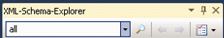

# Gewusst wie: Hinzufügen von Knoten aus dem XML-Schema-Explorer zum Arbeitsbereich

In diesem Thema wird erläutert, wie zum Hinzufügen von Knoten, um die [Arbeitsbereich des XML-Schema-Designers](../xml-tools/xml-schema-designer-workspace.md) vom XML-Schema-Explorer. Knoten können einer XSD-Designer-Ansicht per Drag & Drop oder über das Kontextmenü des XML-Schema-Explorers hinzugefügt werden. Sie können auch Knoten hinzufügen, die als Ergebnis einer Suche zurückgegeben wurden und im XML-Schema-Explorer hervorgehoben sind. Weitere Informationen finden Sie unter [wie: Hinzufügen legen Sie Suche Ergebnis Schemaknoten in den Arbeitsbereich](../xml-tools/how-to-add-schema-set-search-result-nodes-to-the-workspace.md).

> [!NOTE]
> Nur globale Knoten hinzugefügt werden können, um die [Arbeitsbereich des XML-Schema-Designers](../xml-tools/xml-schema-designer-workspace.md).

## So fügen Sie Knoten über das Kontextmenü des XML-Explorers hinzu

1.  Führen Sie die Schritte in [Vorgehensweise: Erstellen und Bearbeiten einer XSD-Schemadatei](../xml-tools/how-to-create-and-edit-an-xsd-schema-file.md).

2.  Klicken Sie mit der rechten Maustaste auf die `PurchaseOrderType` Knoten in der XSD-Explorer. Wählen Sie **in Diagrammansicht anzeigen**.

     Der `purchaseOrderType`-Knoten wird auf der Entwurfsoberfläche der Diagrammansicht angezeigt.

## So verschieben Sie Knoten per Drag & Drop in eine Ansicht

1.  Klicken Sie mit der rechten Maustaste auf den `PurchaseOrderType`-Knoten in der Diagrammansicht. Wählen Sie **im XML-Schema-Explorer anzeigen**.

     Der Knoten wird im XML-Schema-Explorer hervorgehoben.

2.  Klicken Sie mit der rechten Maustaste auf die `PurchaseOrderType` Knoten im XML-Schema-Explorer, und wählen **alle Verweise anzeigen**.

     Der `purchaseOrder`-Knoten wird hervorgehoben.

3.  Ziehen Sie den `purchaseOrder`-Knoten in die Diagrammansicht.

     Der `purchaseOrder`-Knoten und der `PurchaseOrderType`-Knoten werden nebeneinander auf der Entwurfsoberfläche der Diagrammansicht angezeigt. Da die zwei Knoten miteinander verknüpft sind (das `purchaseOrder`-Element ist vom `PurchaseOrderType`-Typ), wird ein Pfeil zwischen den Elementen gezeichnet.

## So fügen Sie Knoten mithilfe der Suchfunktion des Schema-Explorers hinzu

1.  Geben Sie "PurchaseOrder" in das Suchfeld ein, der die [XML-Explorer](../xml-tools/xml-schema-explorer.md) Symbolleiste, und klicken Sie auf die Schaltfläche "Suchen".

     

     Die Suchergebnisse werden im XML-Schema-Explorer hervorgehoben und auf der vertikalen Bildlaufleiste durch Teilstriche markiert.

2.  Die Suchergebnisse dem Arbeitsbereich hinzufügen, indem Sie auf die **hervorgehobene Knoten zu Arbeitsbereich hinzufügen** Schaltfläche im Bereich Zusammenfassung der Ergebnisse.

     

     Die `purchaseOrder` Knoten und die `PurchaseOrderType` -Knoten werden nebeneinander auf der Entwurfsoberfläche der der [Diagrammansicht](../xml-tools/graph-view.md). Da die zwei Knoten miteinander verknüpft sind (das `purchaseOrder`-Element ist vom `PurchaseOrderType`-Typ), wird ein Pfeil zwischen den Elementen gezeichnet.

## Siehe auch

- [XML-Schema-Explorer](../xml-tools/xml-schema-explorer.md)