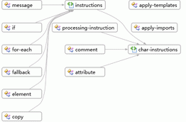

# Vorgehensweise: Bietet einen Überblick über ein Schemaset in der Diagrammansicht

In diesem Thema wird beschrieben, wie Sie mit der [Diagrammansicht](../xml-tools/graph-view.md) um einen allgemeinen Überblick über die Knoten in einem Schemaset und die Beziehungen zwischen den Knoten anzuzeigen.

## So erstellen Sie eine neue XSD-Datei und zeigen Sie das Stammelement in der Inhaltsmodellansicht an

1. Erstellen Sie eine neue XML-Schema-Datei, und speichern Sie die Datei *Relationships.xsd*.

2. Klicken Sie auf die **verwenden Sie XML-Editor anzeigen und bearbeiten die zugrunde liegende XML-Schemadatei** Link in der Ausgangsansicht auf.

3. Kopieren Sie die XML-schemabeispielcode aus [Beispiel-XML-Schema: Beziehungen](../xml-tools/sample-xsd-file-relationships.md) und fügen Sie ihn, um den Standardcode zu ersetzen, das die neue XSD-Datei standardmäßig hinzugefügt wurde.

4. Mit der rechten Maustaste an einer beliebigen Stelle in der XML-Editor, und wählen Sie **Ansicht-Designer**.

5. Wählen Sie die Diagrammansicht aus der **XSD-Symbolleiste**.

6. Wählen Sie **Schemaset** Knoten in der **XML-Schema-Explorer** und ziehen Sie den Knoten auf der Entwurfsoberfläche der Diagrammansicht angezeigt. Nun sollten alle globalen Knoten und Verbindungspfeile zwischen den Knoten mit Beziehungen angezeigt werden.

     

7. Klicken Sie auf der Entwurfsoberfläche auf einen Knoten, und überprüfen Sie in der Breadcrumb-Leiste, wo sich der ausgewählte Knoten im Schemaset befindet.

8. Rick, klicken Sie auf einen Elementknoten, auf die Entwurfsoberfläche, und wählen **Beispiel-XML generieren** XML-Instanzendokument angezeigt.