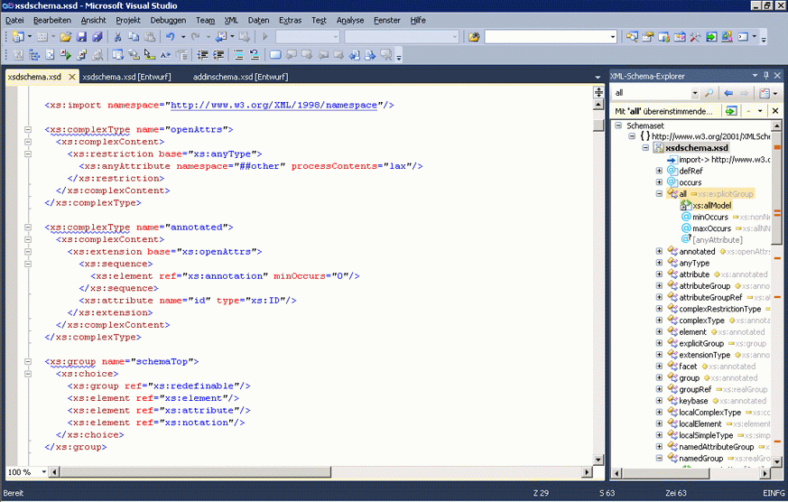
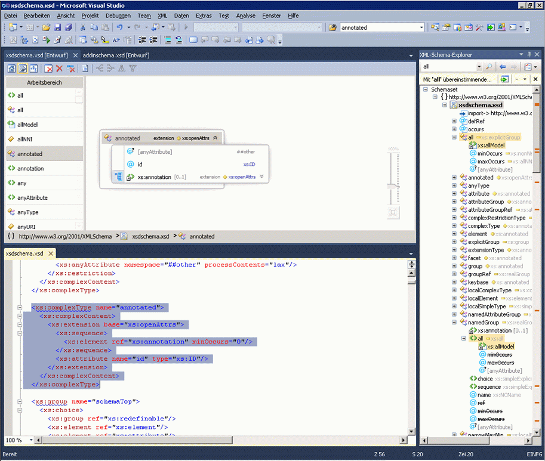

# Integration in XML-editor

Der XML-Schema-Designer ist in den XML-Editor integriert. Wenn Sie eine XSD-Datei im XML-Editor ändern, wird die Änderung in übernommen werden die [XML-Schema-Explorer](../xml-tools/xml-schema-explorer.md). Haben die [Diagrammansicht](../xml-tools/graph-view.md) oder [Inhaltsmodellansicht](../xml-tools/content-model-view.md) geöffnet ist, die Änderung dort ebenfalls wiedergegeben vorhanden. Sie können wie folgt zwischen dem XML-Schema-Designer und dem XML-Editor navigieren:

-   Im XML-Editor mit der rechten Maustaste in eines Knotens, und wählen Sie **im XML-Schema-Explorer anzeigen**.

-   In der Diagrammansicht und die **XML-Schema-Explorer**, doppelklicken Sie auf einen Knoten oder mit der rechten Maustaste in eines Knotens, und wählen Sie **Code anzeigen**. In der Inhaltsmodellansicht mit der rechten Maustaste in eines Knotens, und wählen Sie **Code anzeigen**.

Der folgende Screenshot zeigt ein XML-Schema in geöffnet der **XML-Schema-Explorer**. Die **XML-Schema-Explorer** zeigt das Schemaset in einer Strukturansicht an. Der XML-Editor zeigt die Textansicht des Knotens, der derzeit aktiv ist die **XML-Schema-Explorer**.

Manchmal ist es hilfreich, den Code im XML-Editor und dem grafischen Designer nebeneinander zu sehen. Um beide Dateien gleichzeitig anzuzeigen, mit der rechten Maustaste an einer beliebigen Stelle in der XML-Editor, und wählen Sie **Sicht-Designer**. Wählen Sie in den Fenstern in Visual Studio-Menü **neue horizontale (oder vertikale) Registerkartengruppe**.

## Siehe auch

- [XML-Schema-Explorer](../xml-tools/xml-schema-explorer.md)