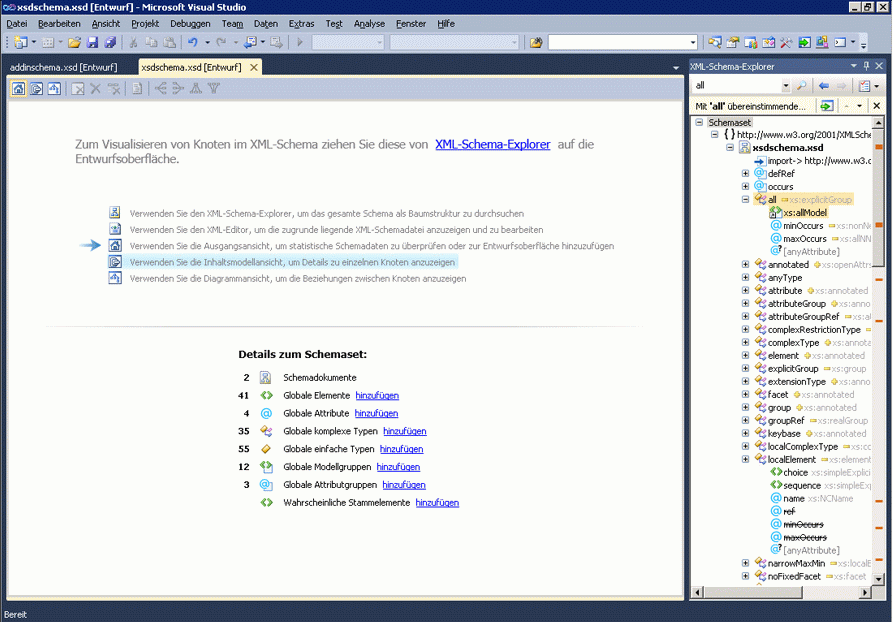

# Ausgangsansicht

Die Ausgangsansicht ist der Ausgangspunkt für die Arbeit mit dem XML-Schema-Designer (XSD). Wenn Sie eine neue XSD-Datei erstellen, sehen Sie zunächst die Ausgangsansicht.

Die Ausgangsansicht enthält zwei Hauptabschnitte der *Wasserzeichen* und **Details zum Schemaset** Bereich. Sie enthält auch die Symbolleiste, die in allen Ansichten des XSD-Designers verfügbar ist.

## Wasserzeichen

Der wasserzeichenbereich enthält eine Liste mit Links zu allen dem XSD-Designer-Ansichten, XML-Editor, und **XML-Schema-Explorer**. Wenn das Schemaset Fehler enthält, wird der folgende Text am Ende der Liste angezeigt: "Verwenden Sie die Fehlerliste, um anzuzeigen, und beheben Sie die Fehler in der Gruppe."

## Details-Schemaset

Die **Details zum Schemaset** Bereich enthält die globalen Schemaknotentypen und zeigt an wie viele Instanzen jedes Typs im Schema vorhanden sind. Sie können die **hinzufügen** Links neben den Knotentypen, mit dem Arbeitsbereich neue Knoten hinzufügen.

## Symbolleiste

Sie können zwischen der Ausgangsansicht, navigieren die [Inhaltsmodellansicht](../xml-tools/content-model-view.md) und [Diagrammansicht](../xml-tools/graph-view.md) aus der XML-Schema-Designer-Symbolleiste.

Die folgenden Schaltflächen sind auf der XSD-Designer-Symbolleiste aktiviert, wenn die Ausgangsansicht aktiv ist:

|Option|Beschreibung|
|-|-----------------|
|**Ausgangsansicht anzeigen**|Wechselt zur Ausgangsansicht. In dieser Ansicht kann mit der Tastenkombination zugegriffen werden: **Ctrl**+**1**.|
|**Inhaltsmodellansicht anzeigen**|Wechselt zur Inhaltsmodellansicht. In dieser Ansicht kann mit der Tastenkombination zugegriffen werden: **Ctrl**+**2**.|
|**Diagrammansicht anzeigen**|Wechselt zur Diagrammansicht. In dieser Ansicht kann mit der Tastenkombination zugegriffen werden: **Ctrl**+**3**.|

## Siehe auch

- [XML-Schema-Explorer](../xml-tools/xml-schema-explorer.md)
- [Diagrammansicht](../xml-tools/graph-view.md)
- [Inhaltsmodellansicht](../xml-tools/content-model-view.md)
- [XML-editor](../xml-tools/xml-editor.md)