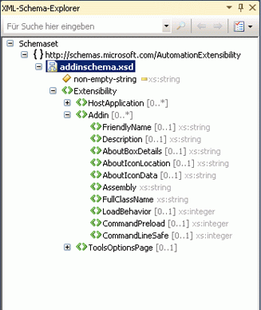

# XML-Schema-Explorer

Die **XML-Schema-Explorer** ist in Microsoft Visual Studio und dem XML-Editor, um die Arbeit mit Schemas für XML Schema Definition Language (XSD) können integriert. Wenn Sie eine XML-Schemadatei öffnen die **Schemaset** Knoten befindet sich der **XML-Schema-Explorer**. Alle enthaltenen, importierten oder neu definierten Schemas für die Zieldatei sowie Dateien, die über verwiesen werden ein `include` oder `import` -Anweisung, erscheinen auch im der **XML-Schema-Explorer**.

 Die **XML-Schema-Explorer** können Sie die folgenden Schritte ausführen:

-   Abrufen einer kurzen Übersicht über das Schemaset.

-   Durchsuchen und Navigieren in der Struktur.

-   Durchführen von schlüsselwort- und schemaspezifischen Suchvorgängen. Weitere Informationen finden Sie unter [Durchsuchen des Schemasets](../xml-tools/searching-the-schema-set.md).

-   Hinzufügen der Suchergebnisse auf Diagramm- oder Inhaltsmodellansicht anzeigen

-   Sortieren der Struktur nach Dokumentreihenfolge, Typ oder Namen. Weitere Informationen finden Sie unter [sortieren, Filtern und Gruppieren von](../xml-tools/sorting-filtering-and-grouping-xml-schema-explorer.md).

-   Öffnen des XML-Editors und Springen zu Codepositionen in der XSD-Datei. Weitere Informationen finden Sie unter [Integration mit XML-Editor](../xml-tools/integration-with-xml-editor.md).

-   Generieren von Beispiel-XML für globale Elemente.

Die **XML-Schema-Explorer** stellt eine hierarchische Ansicht des Schemasets einer Strukturansicht an. Die **XML-Schema-Explorer** bietet auch die Suche, Filterung, Navigation und Sortierung. Für den Zugriff auf die **XML-Schema-Explorer**, führen Sie einen der folgenden:

-   Bei der [Ausgangsansicht](../xml-tools/start-view.md), klicken Sie auf die **XML-Schema-Explorer** Link.

-   Bei der [Diagrammansicht](../xml-tools/graph-view.md) oder [Inhaltsmodellansicht](../xml-tools/content-model-view.md) und Knoten in Ihrem Arbeitsbereich haben, verwenden Sie das Kontextmenü (Rechtsklick) auf die **XML-Schema-Explorer**.

-   Sie können auch auswählen, die **XML-Schema-Explorer** aus der **Ansicht** Menü.

-   Sie erreichen die **XML-Schema-Explorer** aus eine *vb* -Datei mit Visual Basic-XML-Literal zugeordnete ein *XSD* Datei. Festlegen, um das Schema finden in der **XML-Schema-Explorer**mit der rechten Maustaste auf einen XML-Knoten in einem XML-Literal oder einem XML-Namespaceimport, und wählen Sie die **im Schema-Explorer anzeigen** Befehl. Weitere Informationen finden Sie unter [Integration von XML-Literalen in den XML-Schema-Explorer](../xml-tools/integration-of-xml-literals-with-xml-schema-explorer.md).

## Strukturansicht
 Die **XML-Schema-Explorer** zeigt vorkompilierte Schemaset Informationen in einer Baumstruktur. Die Struktur ist wie folgt aufgebaut:

-   Auf oberster Ebene befindet sich der Schemasetknoten.

-   Die zweite Ebene enthält die Namespaces.

-   Die dritte Ebene enthält die Dateien.

-   Die vierte Ebene enthält die globalen Knoten. Dazu können Elemente, Gruppen, komplexe Typen, einfache Typen, Attribute, Attributgruppen und `include`-, `import`- und `redefine`-Anweisungen gehören.

Im Folgenden Sie ein Beispiel für eine Struktur:

## Auswahl und Aktivierung
 Klicken Sie im Schema-Explorer einmal auf einen Knoten, um ihn hervorzuheben und auszuwählen.

 Um einen Knoten zu aktivieren, doppelklicken Sie darauf, oder drücken Sie **EINGABETASTE** Wenn der Knoten ausgewählt ist.

-   Durch das Aktivieren eines Knotens wird die Datei, in der dieser Knoten definiert ist, geöffnet (wenn sie nicht bereits geöffnet ist), und der Knoten wird in der Datei ausgewählt.

-   Durch das Aktivieren eines Dateiknotens wird die ausgewählte Datei geöffnet (wenn sie nicht bereits geöffnet ist), und der Knoten `<schema>` wird hervorgehoben.

-   Beim Aktivieren eines Schemaset- oder Namespaceknotens geschieht nichts.

## Drag & drop von Knoten
 Sie können globale Knoten, Dateiknoten und Namespaceknoten per Drag & Drop in einer XSD-Designer-Ansicht ablegen. Wenn die aktuelle Ansicht ist die [Ausgangsansicht](../xml-tools/start-view.md), ziehen einen Knoten in der Ansicht wird geöffnet. die [Diagrammansicht](../xml-tools/graph-view.md). Wenn die aktuelle Ansicht ist die [Inhaltsmodellansicht](../xml-tools/content-model-view.md) oder Diagrammansicht die Sicht wird nicht geändert werden, wenn Sie einen Knoten in löschen.

 Ablegen von Dateien in der Ansicht werden alle globalen Knoten in der Datei hinzufügen die [Arbeitsbereich des XSD-Designers](../xml-tools/xml-schema-designer-workspace.md). Wenn Sie Namespaces in der Ansicht ablegen, werden dem Arbeitsbereich alle globalen Knoten im Namespace hinzugefügt. Der Arbeitsbereich wird für alle Ansichten verwendet.

 Lokale Knoten oder Importe können nicht per Drag & Drop verschoben werden.

## Siehe auch

- [Vorgehensweise: Hinzufügen von Knoten mit dem Arbeitsbereich aus der XML-Schema-Explorer](../xml-tools/how-to-add-nodes-to-the-workspace-from-the-xml-schema-explorer.md)