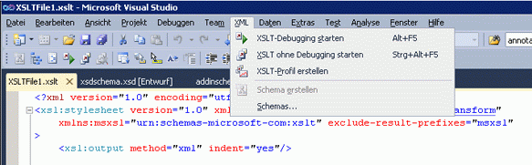

# XSLT-Profiler
[!INCLUDE[vs2017banner](../code-quality/includes/vs2017banner.md)]

Der XSLT\-Profiler ist ein Leistungsanalyse\-Profilertool, das Ihnen hilft, XSLT\-Dokumente zu entwickeln und zu debuggen.Der XSLT\-Profiler ermöglicht Entwicklern durch das Erstellen von ausführlichen XSLT\-Leistungsberichten, leistungsbezogene XSLT\-Codeprobleme zu messen und zu bewerten.Der XSLT\-Profiler enthält nützliche Hinweise zu XSL\- und XSLT\-Stylesheetoptimierungen, die für XSLT\-basierte Anwendungen wichtig sind, die eine optimale Leistung erfordern.  
  
 Der XSLT\-Profiler ist Teil von Visual Studio 2010 und ist im Menü\-**XML** von Visual Studio verfügbar.  
  
   
  
 Der XSLT\-Profiler wurde zuerst als Add\-In für Visual Studio 2008 veröffentlicht.Weitere Informationen finden Sie im Abschnitt "Related Resources" auf der Seite [XSLT Profiler for Visual Studio Feb 08 Community Technology Preview](http://go.microsoft.com/fwlink/?LinkId=142987).  
  
> [!NOTE]
>  Einige Bildschirme sehen in Visual Studio 2010 möglicherweise anders aus als in diesen Dokumenten, da einige visuelle Elemente gegenüber Visual Studio 2008 geändert wurden.  
  
## Siehe auch  
 [Exemplarische Vorgehensweise: XSLT\-Profiler](../xml-tools/walkthrough-xslt-profiler.md)